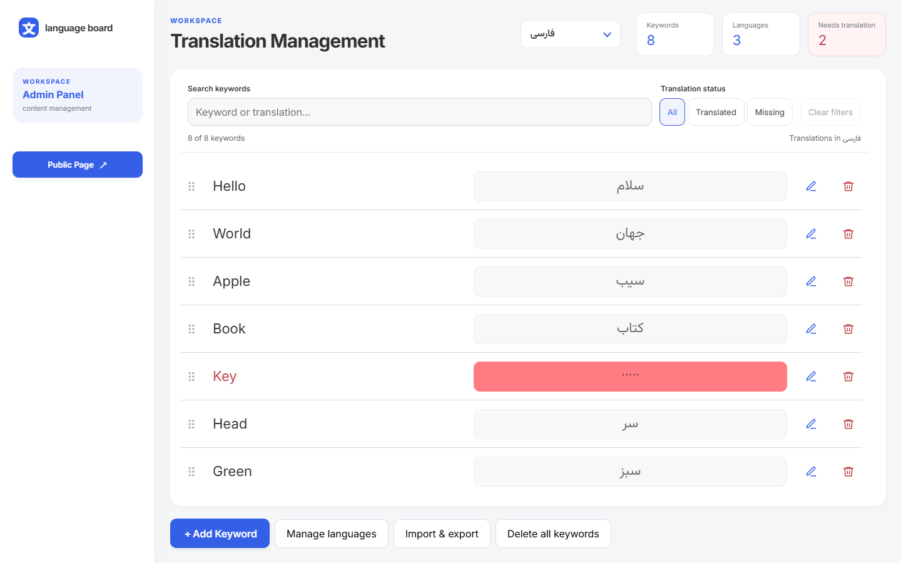
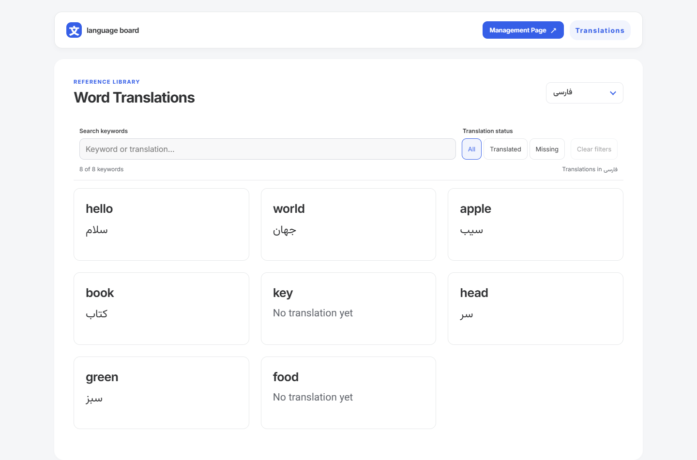
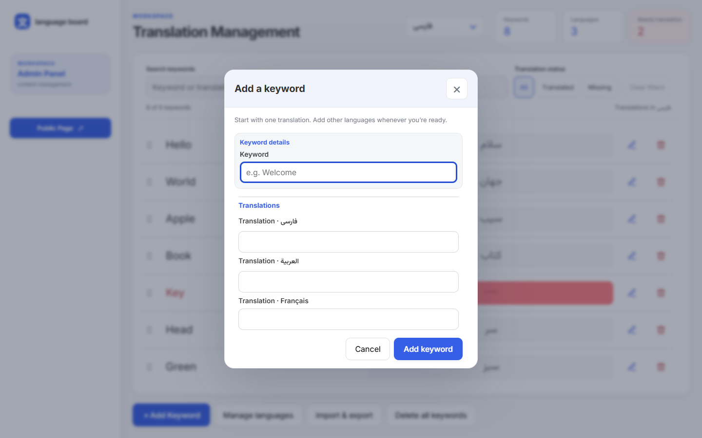
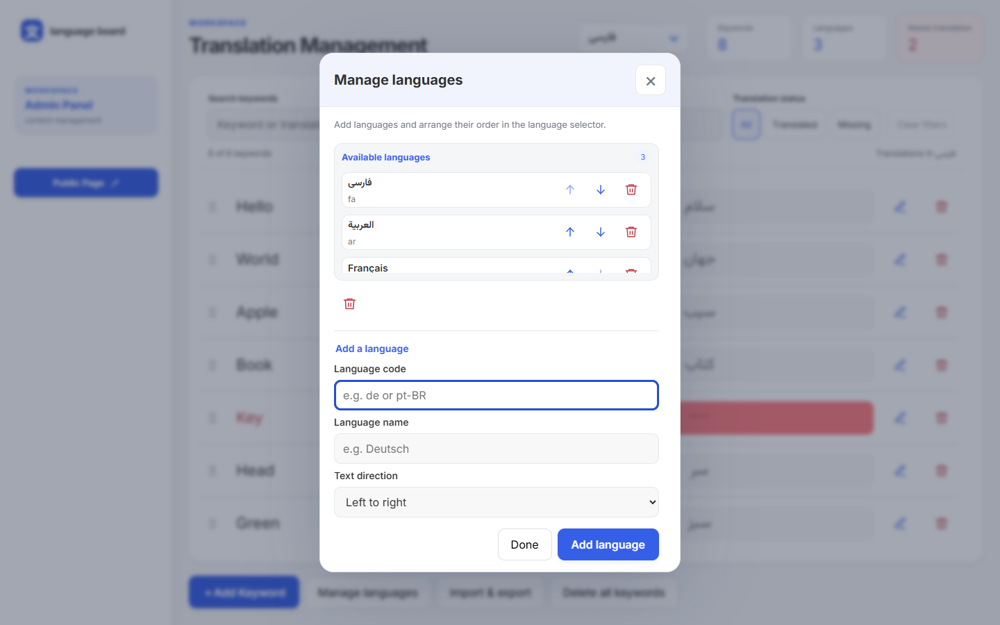

# Language Board

برنامهٔ واکنش‌گرای مدیریت واژه‌ها و ترجمه‌ها با React و TypeScript؛ شامل صفحهٔ مطالعه، ویرایش ترجمه، افزودن واژهٔ چندزبانه و مدیریت زبان‌ها. داده‌ها در مرورگر ذخیره می‌شوند و برنامه backend ندارد.

## شروع سریع

Node.js نسخهٔ 22.12 یا بالاتر و npm لازم است (محیط بررسی: Node 22.14 روی Windows).

```sh
npm ci
npm run dev
```

صفحهٔ عمومی: <http://127.0.0.1:5173/> — مدیریت: <http://127.0.0.1:5173/manage>

مسیر `/` صفحهٔ عمومی است. مسیرهای ناشناخته، از جمله `/public` قدیمی، به `/` هدایت می‌شوند. زبان رابط انگلیسی است؛ انتخاب زبان، ترجمه‌ها و جهت متن آن‌ها را تغییر می‌دهد.

## پیش‌نمایش نسخهٔ فعلی

### مدیریت ترجمه‌ها



### صفحهٔ عمومی



### افزودن واژه و مدیریت زبان‌ها





برای تصاویر موبایل و تمام اندازه‌ها، [گالری و روش بازتولید تصاویر](docs/screenshots/README.md) را ببینید.

## امکانات

- شروع با ۸ واژه و زبان‌های فارسی، عربی و فرانسوی؛ ترجمهٔ فارسی Key و Food عمداً خالی است.
- ویرایش درجا و ذخیرهٔ خودکار ترجمه‌ها، واژه‌ها و ترتیب آن‌ها در `localStorage`.
- افزودن واژه با فیلد جداگانه برای تمام زبان‌ها؛ حداقل یک ترجمه لازم است.
- جابه‌جایی واژه‌ها با drag-and-drop در ماوس و صفحهٔ لمسی و نیز با صفحه‌کلید، با ترتیب مشترک در همهٔ زبان‌ها.
- افزودن زبان با کد استاندارد، نام نمایشی و جهت متن؛ جابه‌جایی و حذف زبان همراه ترجمه‌هایش.
- صفحهٔ عمومی فقط‌خواندنی با نمایش `No translation yet` برای ترجمهٔ خالی.
- دیالوگ بومی، بازگرداندن فوکوس، خطاهای فرم و پشتیبانی از reduced motion.
- اعتبارسنجی ساختار ذخیره‌شده و هشدار خطای ذخیره‌سازی.

## انتقال داده با JSON

در صفحهٔ مدیریت، دکمهٔ **Import & export** را انتخاب کنید. **Download JSON** تمام زبان‌ها، کلیدواژه‌ها، ترجمه‌ها و ترتیب آن‌ها را مستقل از فیلتر جاری دانلود می‌کند. فایل خروجی قالب نسخهٔ ۲ برنامه را دارد.

برای بازیابی، فایل JSON نسخهٔ ۲ (حداکثر ۲۰ مگابایت) را انتخاب کنید. پس از اعتبارسنجی، تعداد زبان‌ها و کلیدواژه‌ها نمایش داده می‌شود. گزینهٔ تأیید جایگزینی را فعال و **Replace & import** را انتخاب کنید. ایمپورت داده‌ها را جایگزین می‌کند؛ ادغام انجام نمی‌شود. فایل نامعتبر یا لغو عملیات، دادهٔ فعلی را تغییر نمی‌دهد. می‌توانید قبل از جایگزینی، از همین دیالوگ نسخهٔ پشتیبان بگیرید.

فایل‌ها در مرورگر پردازش می‌شوند و به سروری ارسال نمی‌شوند. اگر ذخیره‌سازی مرورگر در دسترس نباشد، دادهٔ واردشده فقط در همان نشست باقی می‌ماند و پیام مربوط نمایش داده می‌شود.

## راهنمای مستندات

| سند                                            | محتوا                                    |
| ---------------------------------------------- | ---------------------------------------- |
| [راهنمای کاربری](docs/user-guide.fa.md)        | گردش کار، ورودی‌ها، زبان‌ها و رفع اشکال  |
| [معماری و توسعه](docs/architecture.fa.md)      | ساختار پوشه‌ها، جریان داده و توسعه‌پذیری |
| [مدل داده و ذخیره‌سازی](docs/data-model.fa.md) | schema، reducer، اعتبارسنجی و بازیابی    |
| [کامپوننت‌ها](docs/components.fa.md)           | مسئولیت اجزا و قراردادهای فرم و Context  |
| [استایل‌ها](docs/styles.fa.md)                 | CSS Modules، توکن‌ها و breakpointها      |
| [آزمون و استقرار](docs/testing.fa.md)          | دستورات، نتایج بررسی و میزبانی           |
| [تصاویر](docs/screenshots/README.md)           | گالری دسکتاپ/موبایل و ثبت مجدد تصاویر    |

## دستورات پروژه

| دستور                           | کاربرد                                     |
| ------------------------------- | ------------------------------------------ |
| `npm run dev`                   | سرور توسعه روی loopback                    |
| `npm run build`                 | بررسی TypeScript و خروجی Vite در dist      |
| `npm run preview`               | مشاهدهٔ خروجی build، معمولاً روی پورت 4173 |
| `npm run lint`                  | ESLint                                     |
| `npm test`                      | آزمون‌های واحد دامنه و مخزن                |
| `npm run test:e2e`              | مجموعهٔ آزمون‌های Playwright               |
| `npm run test:docs:screenshots` | تولید مجدد تصاویر مستندات                  |
| `npm run format:check`          | بررسی قالب‌بندی                            |
| `npm run format`                | قالب‌بندی فایل‌های پروژه                   |

برای Playwright ابتدا `npx playwright install chromium` را اجرا کنید. در Windows می‌توان از Edge نصب‌شده استفاده کرد:

```powershell
$env:PLAYWRIGHT_CHANNEL = 'msedge'
npm run test:docs:screenshots
```

## فناوری و محدوده

React 19، TypeScript، Vite، React Router، Context و reducer، Sass، React Hook Form، Yup و `@hello-pangea/dnd`؛ آزمون‌ها با Vitest و Playwright. نسخه‌های دقیق نصب در `package-lock.json` ثبت شده‌اند. فونت‌های Inter و Vazirmatn به‌صورت محلی bundle می‌شوند.

«Public» به معنی نمایش فقط‌خواندنی همان دادهٔ محلی است؛ ورود کاربر، سطح دسترسی، انتشار روی سرور یا همگام‌سازی بین دستگاه‌ها وجود ندارد. انتخاب زبان در جابه‌جایی داخلی صفحه‌ها حفظ می‌شود؛ پس از reload زبان اول فهرست انتخاب می‌شود. چند تب snapshot مستقل دارند و آخرین ذخیره برنده است.

جست‌وجو، فیلتر وضعیت ترجمه، حذف و ویرایش واژه و انتقال JSON در رابط مدیریت در دسترس‌اند.
