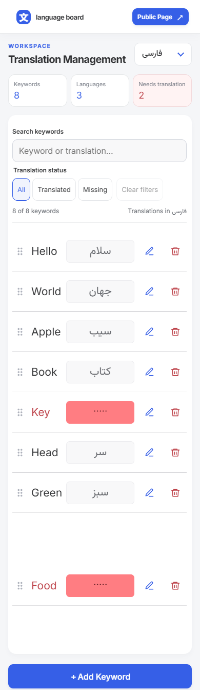
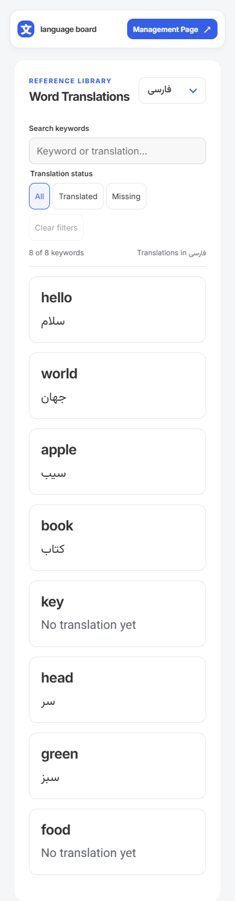
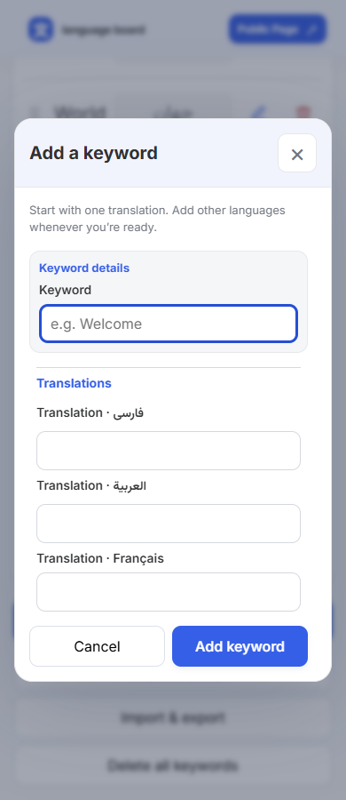
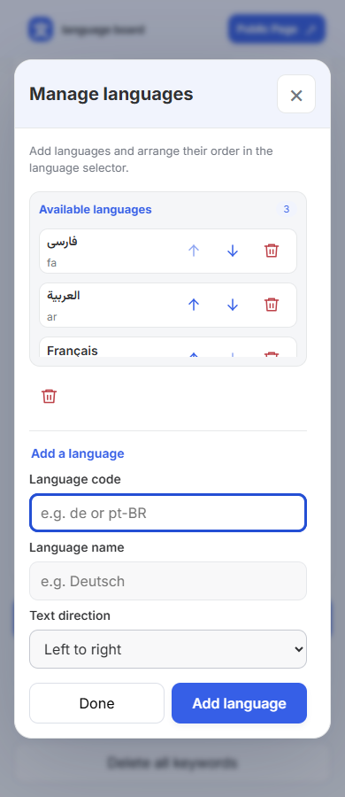

# گالری تصاویر برنامه

[معرفی](../../README.md) · [راهنمای کاربری](../user-guide.fa.md)

این تصاویر از اجرای واقعی برنامه با دادهٔ آغازین، زبان فارسی و storage مستقل Playwright تهیه می‌شوند. تصاویر بازسازی گرافیکی نیستند و اطلاعات شخصی مرورگر را نمایش نمی‌دهند.

## نمای موبایل

| مدیریت، عرض 390                  | عمومی، عرض 390                  |
| -------------------------------- | ------------------------------- |
|  |  |

| افزودن واژه، عرض 390                          | مدیریت زبان، عرض 390                    |
| --------------------------------------------- | --------------------------------------- |
|  |  |

## نمای دسکتاپ


## فایل‌های تمام اندازه‌ها

| عرض viewport | مدیریت                   | عمومی                    | افزودن واژه                   | زبان‌ها                     |
| ------------ | ------------------------ | ------------------------ | ----------------------------- | --------------------------- |
| 320px        | [تصویر](manage-320.png)  | [تصویر](public-320.png)  | [تصویر](add-keyword-320.png)  | [تصویر](languages-320.png)  |
| 390px        | [تصویر](manage-390.png)  | [تصویر](public-390.png)  | [تصویر](add-keyword-390.png)  | [تصویر](languages-390.png)  |
| 768px        | [تصویر](manage-768.png)  | [تصویر](public-768.png)  | [تصویر](add-keyword-768.png)  | [تصویر](languages-768.png)  |
| 1024px       | [تصویر](manage-1024.png) | [تصویر](public-1024.png) | —                             | —                           |
| 1440px       | [تصویر](manage-1440.png) | [تصویر](public-1440.png) | [تصویر](add-keyword-1440.png) | [تصویر](languages-1440.png) |
| 1920px       | [تصویر](manage-1920.png) | [تصویر](public-1920.png) | —                             | —                           |

## بازتولید

```sh
npm ci
npx playwright install chromium
npm run test:docs:screenshots
```

در Windows با Edge نصب‌شده:

```powershell
$env:PLAYWRIGHT_CHANNEL = 'msedge'
npm run test:docs:screenshots
```

Playwright سرور توسعه را راه‌اندازی می‌کند. هر اندازه context تازه دارد؛ دادهٔ شخصی دستکاری نمی‌شود. capture پس از نمایش محتوای اصلی و بارگذاری فونت‌ها انجام می‌شود. ارتفاع viewport برابر 900، reduced motion فعال و animation در capture غیرفعال است. صفحه‌ها با fullPage ثبت می‌شوند و ارتفاع فایل می‌تواند بیش از 900 باشد؛ دیالوگ‌ها فقط در viewport ثبت می‌شوند تا پس‌زمینهٔ ثابت مرورگر درست نمایش داده شود. دیالوگ بلند ممکن است ناحیهٔ داخلی قابل اسکرول داشته باشد؛ تصویر وضعیت اولیهٔ آن را ثبت می‌کند.

آخرین تولید: ۲۰۲۶-۰۹-۲۴ با Edge روی Windows؛ هر ۶ سناریو موفق بود. نماهای نمونهٔ موبایل و دسکتاپ و هر دو دیالوگ به‌صورت چشمی بررسی شدند.

۲۰ تصویر تولید می‌شود: ۱۲ تصویر صفحه و ۸ تصویر دیالوگ. فایل‌های PNG با اجرای مجدد بازنویسی می‌شوند. سناریو برای هر عرض، نبود overflow افقی سند را نیز بررسی می‌کند. پس از capture دست‌کم نماهای 320/390 و 1440 و هر دو دیالوگ بازبینی چشمی شوند.
